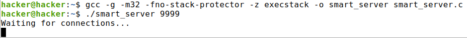
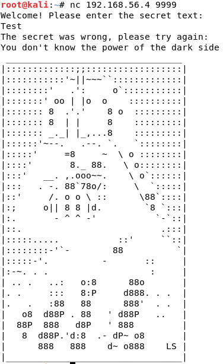
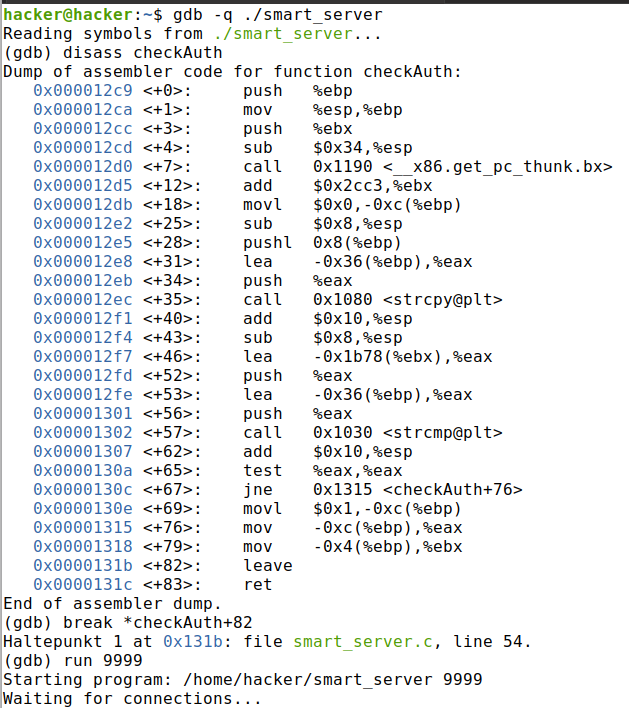
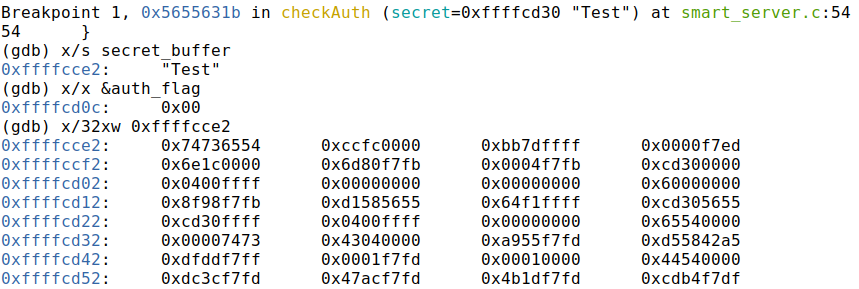
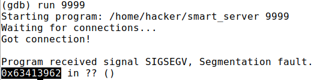
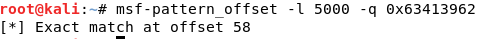
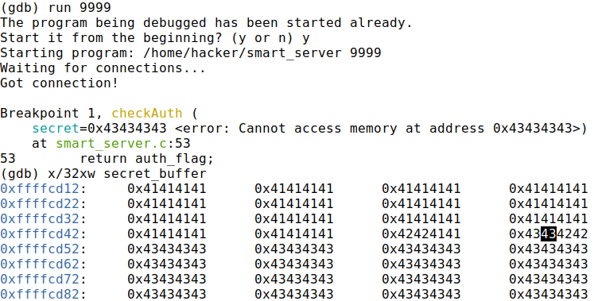
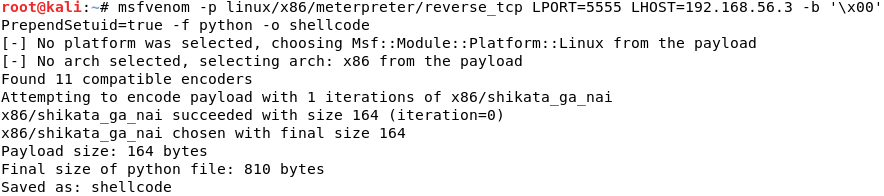
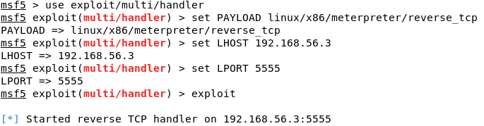
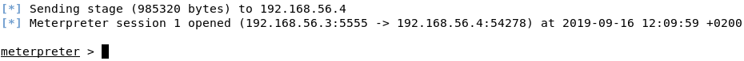

# Vulnerable Server

> **CAUTION:** Don't use the compiled smart_server.c on a production server or on your own machine. It's recommended to use a virtual machine instead. Using it on a production server or on the own machine brings a risk to the whole operating system, because the existing hole could be exploited and a shellcode could be injected to the system by a thrid person (e.g. a hacker).

The SmartServer is a simple socket server that can be used to getting basic knowledge how buffer overflows works and what can be done with the resulting access through the hole.

## Buffer Overflows
Writing data to a buffer in a program, where the data size is greather than the size of the buffer, leads to buffer overflow. The data that overflows, overwrites content of the memory at that location. It is neccessary to check that the size of data isn't greather than the buffer size, before writing data into the buffer. Otherwhise shellcode could be injected into the system and for example a backdoor could be opened on the victim for the hacker. This project shows up one most common security hole in a program, that can be used to inject shellcode through a buffer overflow. To get more knowledge about the buffer overflow you can see [here](https://insecure.org/stf/smashstack.html).

## Buffer Overflow in the smart_server
First of all this exploit was only executed as a 32-Bit program, because 64-Bit has a longer address space and it is more complex to get the exploit run there. This server was only tested on a linux operating system, because on windows the GNU compiler and debugger may not work and other tools will be neccessary.

Before the exploit can be executed the server must be compiled with the following command. The param `-m32` means that the porgram gets compiled as a 32-Bit program, `-g` enables debugging for the compiled program. In modern operating systems there are security features like stack protection, not executeable stack and address space layout randomization (ASLR). To disable the ASLR a flag on the kernel must be set with the following command (a reboot may be neccessary):
```bash
echo 0 > /proc/sys/kernel/randomize_va_space
```
The stack protector gets disabled with the param `-fno-stack-protector` and the stack gets executeable with the param `-z exec-stack`. It may be possible to get the server exploited with enabled security features but to get only the basic knowledge about buffer overflows the security features were disabled. This is another reason to run the server only on a virtual machine and not on a real, accessable form the internet, server. After compiling the program to the outputfile specified with the `-o` flag, it can be started by executing the file and passing the port number on which the socket should listen.



To test the server with the correct inputs netcat can be used as follows:



### Denial-of-Service-Attack
The first try is to send a big input to the server and check what will be the result. In the follwing example a python generated string containing 5000 A's is send to the server via netcat. The result will be after executing the command a not reachable server, caused by a segmentation fault. This is a successfull denial-of-service-attack, which has the target to overload a server, so that only few or no more requests can be handled. Also the error gives a hint for a possible buffer overflow, because in this case the memory address of the next command gets overwritten and if the new content doesn't represent a correct memory address a segmentation fault will be the result.


### Bypass survey
The next possibility is to get with a buffer overflow access to the image form the server without knowing the correct secret text. 






### Reverse-TCP-Connection through shellcode injection
Another possibility is to inject shellcode into the server with a buffer overflow and get access to the machine. 


















